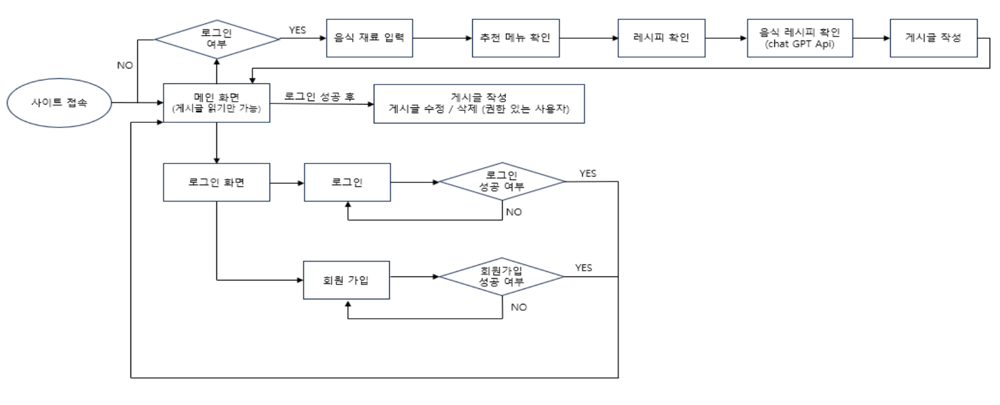
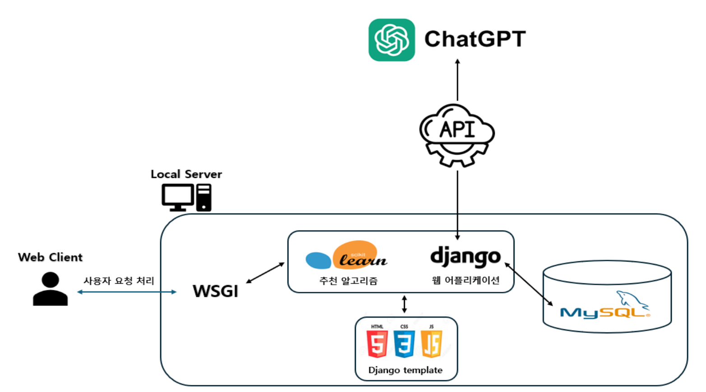
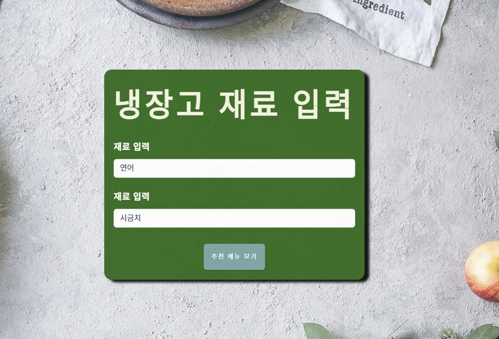
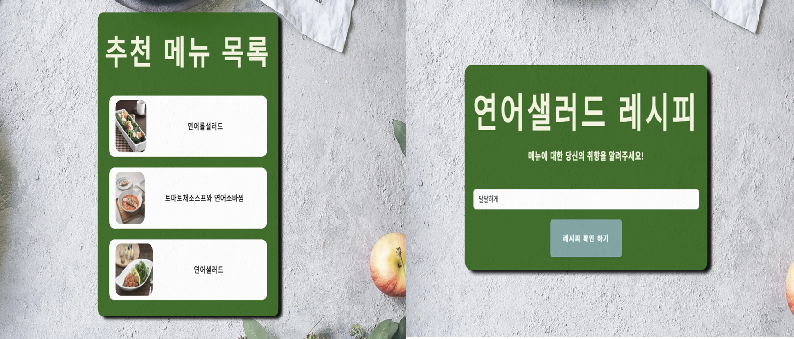
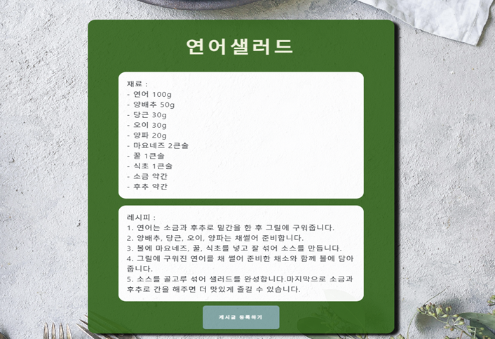

# 🧑‍🍳코사인 유사도 기반 자취생을 위한 메뉴 추천 서비스

###  💡프로젝트 목적

- 요리에 미숙한 자취생 혹은 일반 사용자들에게 식단에 대한 고민 해결

- 개인 취향을 반영한 맞춤형 레시피를 제공해 요리 과정에서의 어려움을 해소

###  💡프로젝트 소개

- 재료 입력 후 코사인 유사도 기반 3가지 추천 메뉴 제시

- 사용자 취향 입력 후 ChatGPT를 통해 레시피 제공

- 레시피를 공유할 수 있는 커뮤니티 페이지

###  💡기술 스택

 

###  💡플로우 차트

###  💡서비스 아키텍처

###  💡웹 사이트 소개

- **사용자는 자신의 레시피를 커뮤니티 페이지를 통해 공유할 수 있습니다.**

- **사용자가 보유한 재료를 입력하여 메뉴를 추천 받을 수 있습니다.**

- **추천 받은 메뉴 중 하나를 선택하여 자신의 취향을 반영한 레시피를 받을 수 있습니다.**

